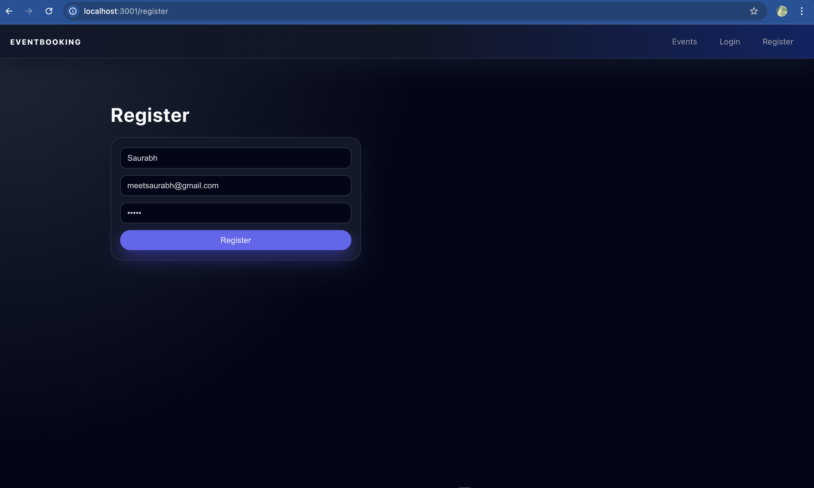
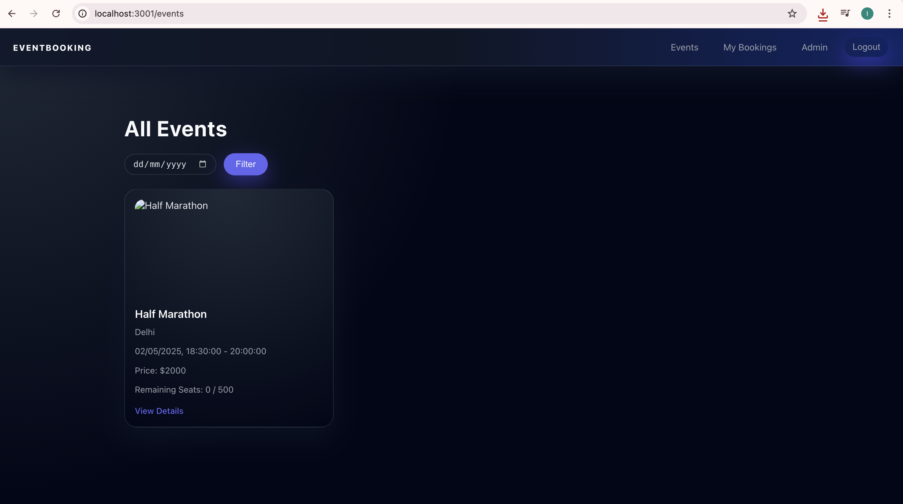
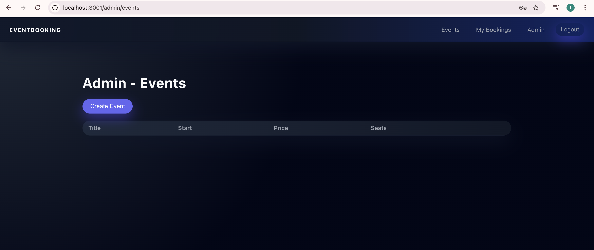
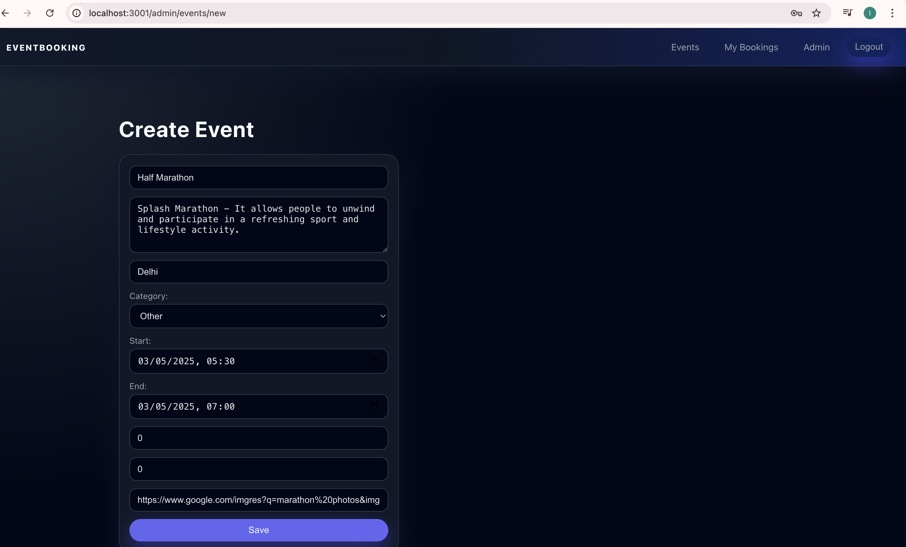
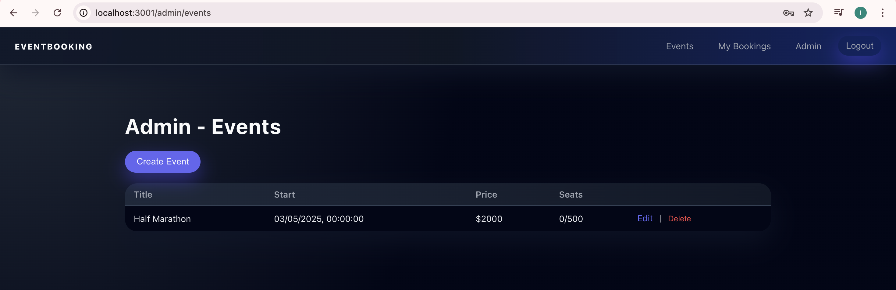
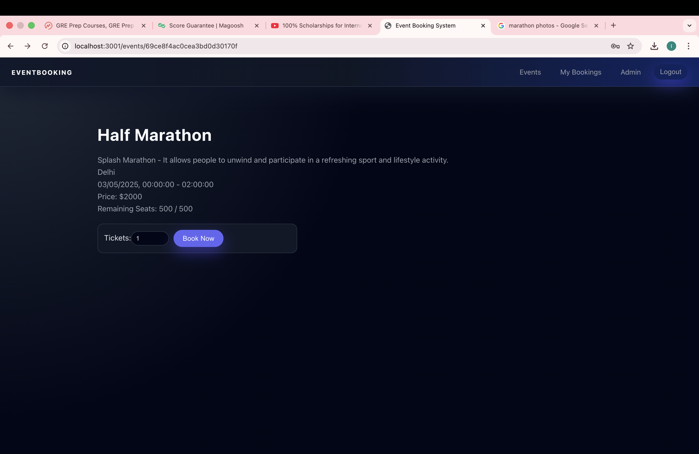
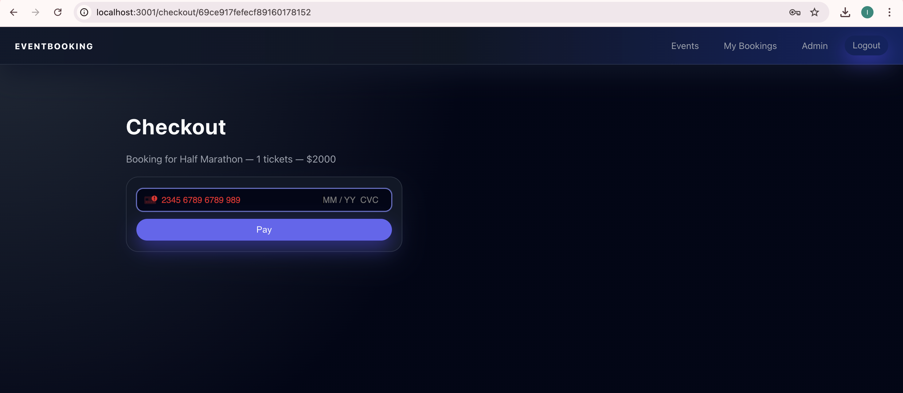
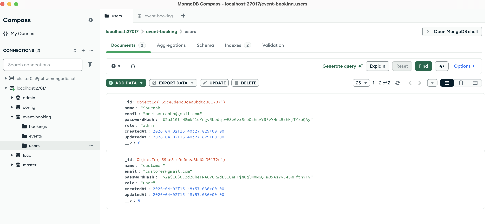
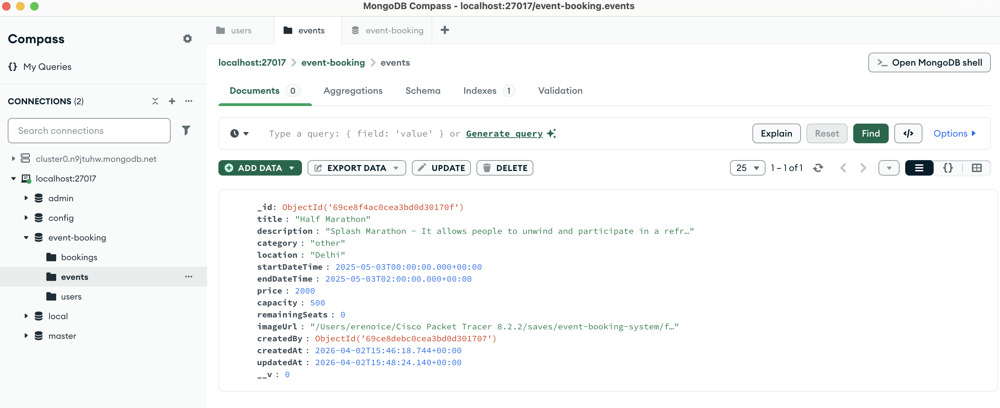

# Event Booking System (MERN)

A simple Event Booking System built with MongoDB, Express.js, React, and Node.js (MERN).  
Users can browse events, view availability, book tickets, and pay via Stripe test mode.  
Admins can create and manage events and pricing.

## Tech Stack & Versions

- Node.js: v18.x
- MongoDB: v6.x (or any recent version)
- Backend:
  - Express: ^4.18.2
  - Mongoose: ^7.0.0
  - JsonWebToken: ^9.0.0
  - Bcryptjs: ^2.4.3
  - Stripe: ^12.0.0
- Frontend:
  - React: ^18.0.0
  - React Router DOM: ^6.22.0
  - Axios: ^1.6.0
  - @stripe/react-stripe-js: ^2.3.0
  - @stripe/stripe-js: ^2.3.0

## Project Structure

```text
event-booking-system/
  backend/
    src/
      config/
      controllers/
      middlewares/
      models/
      routes/
      index.js
    package.json
  frontend/
    src/
      components/
      context/
      pages/
      services/
      App.js
      index.js
    package.json
  README.md
```

## Environment Variables

Create `backend/.env`:

```bash
PORT=5000
MONGODB_URI=mongodb://localhost:27017/event-booking
JWT_SECRET=your_jwt_secret_here
STRIPE_SECRET_KEY=sk_test_your_stripe_secret_key
CLIENT_URL=http://localhost:3000
```

Create `frontend/.env`:

```bash
REACT_APP_API_URL=http://localhost:5000/api
REACT_APP_STRIPE_PUBLISHABLE_KEY=pk_test_your_publishable_key
```

## Setup & Run

### Backend

```bash
cd backend
npm install
npm run dev     # or npm start
```

### Frontend

```bash
cd frontend
npm install
npm start
```

Then open `http://localhost:3001`.

## Default Users

- Register normally as a user via the UI.
- To create an admin, manually update a user’s `role` field in MongoDB to `"admin"`.

## Screenshots

### Register Page


### Home Page


### Events Page


### Event Detail


### Admin Panel



### Booking Page


### Booking Checkout Page


### User Database


### Event Database

